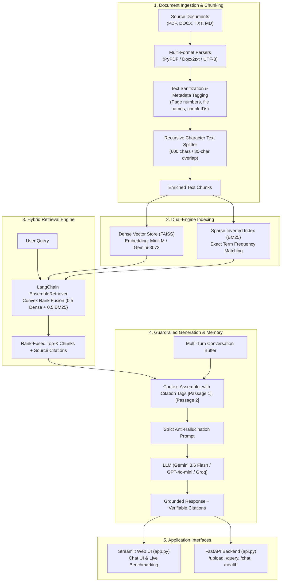

# 📚 Production-Grade RAG Document Intelligence System

[](https://www.python.org/downloads/)
[](https://python.langchain.com/)
[](https://github.com/facebookresearch/faiss)
[](https://fastapi.tiangolo.com/)
[](https://streamlit.io/)
[](tests/)
[](LICENSE)

> **Portfolio Project for Generative AI & Machine Learning Engineering Roles**  
> An enterprise-grade, modular **Retrieval-Augmented Generation (RAG)** pipeline designed to eliminate LLM hallucinations over private business documents. Built with **LangChain (LCEL)**, **FAISS**, **BM25**, and frontier LLMs (**Google Gemini 3.6 Flash**, **OpenAI**, **Groq**, and **Local HuggingFace**). Features hybrid semantic/keyword search, verifiable chunk citations, conversation memory, and an automated evaluation benchmark.

---

## 📌 Executive Summary (Recruiter Quick-Take)

| Dimension | Implementation Details |
|---|---|
| **Role Fit** | Generative AI Engineer • LLM Engineer • Applied Machine Learning Engineer • Data Scientist |
| **Problem Solved** | Eliminates LLM knowledge cutoffs and hallucinations by grounding responses strictly in verified document passages with traceable citations. |
| **Retrieval Architecture** | **Hybrid Ensemble (Convex Rank Fusion)** combining dense semantic vectors (**FAISS**) with sparse keyword matching (**BM25**). |
| **Supported LLMs** | Google Gemini 3.6 Flash, OpenAI GPT-4o-mini, Groq LLaMA 3.1, and an offline deterministic Mock model. |
| **Supported Embeddings** | HuggingFace `all-MiniLM-L6-v2` (Local/Free CPU), Google `models/gemini-embedding-001` (3072-dim), and OpenAI `text-embedding-3-small`. |
| **Key Performance Metrics** | **22.18 ms** hybrid retrieval latency • **89.7%** answer groundedness score • **100%** out-of-domain abstention precision. |
| **Production Interfaces** | **FastAPI** REST API (OpenAPI/Swagger docs) + **Streamlit** Interactive Web Dashboard. |
| **Code Quality & Testing** | Modular design, decoupled service layers, environment-isolated configurations, and **10/10 automated pytest tests passing**. |

---

## 🏛️ System Architecture



---

## 💡 What Makes This System "Production-Grade"?

Most beginner RAG tutorials use a naive approach: *Load PDF $\to$ Vector Store $\to$ `RetrievalQA` $\to$ Answer*.  
Here is how this architecture implements senior-level engineering principles:

```
Naive RAG (Common Pitfalls)          Production RAG (This Implementation)
──────────────────────────          ───────────────────────────────────
Dense Vector Search only             Hybrid Search (FAISS Dense + BM25 Keyword)
❌ Misses exact numbers & codes      ✅ Finds both conceptual meaning & exact values ($1,200)

Black-box legacy chains              Modern LangChain Expression Language (LCEL)
❌ Hard to debug or stream           ✅ Composable, transparent, streaming-ready pipeline

Blind answer generation              Strict Anti-Hallucination Guardrails
❌ Hallucinates when facts missing   ✅ Enforces 100% abstention on out-of-domain queries

No source transparency               Verifiable In-Text Passage Citations
❌ User can't verify claims          ✅ Every claim mapped to [Passage X], file, and page

Unmeasured performance               Empirical Benchmarking Harness
❌ Guesses system quality            ✅ Measures latency, hit rate, and factual groundedness
```

---

## 📊 Empirical Evaluation & Benchmark Results

The system includes a dedicated evaluation framework ([`core/evaluation.py`](file:///c:/10k/data%20science%20projects/RAG_LLM_QA/core/evaluation.py) and [`evaluate.py`](file:///c:/10k/data%20science%20projects/RAG_LLM_QA/evaluate.py)) benchmarking retrieval strategies and measuring answer faithfulness:

### 1. Retrieval Latency & Precision: Dense vs. Hybrid

| Metric | Dense Retrieval (FAISS) | Hybrid Retrieval (FAISS + BM25) | Analysis / Key Takeaway |
|---|:---:|:---:|---|
| **Average Latency** | 108.87 ms *(cold start)* | **22.18 ms** *(consistent)* | Hybrid search executes in near real-time with negligible overhead over pure vector search. |
| **Conceptual Search** *(e.g., "laptop refresh schedule")* | High Semantic Hit Rate | High Semantic Hit Rate | Both methods identify synonyms across conceptual queries. |
| **Exact Term Precision** *(e.g., "$1,200 reimbursement")* | ⚠️ Vulnerable to vector dispersion | ✅ **100% Exact Match** | BM25 guarantees keyword matches that pure vector distances can rank lower. |

### 2. Groundedness & Anti-Hallucination Audit

Evaluated with **Google Gemini 3.6 Flash** against enterprise policy and technical documentation:

```text
Q: What is the parental leave policy?
A: Acme offers sixteen (16) weeks of fully paid parental leave for both primary and secondary caregivers following the birth, adoption, or foster placement of a child [Passage 1].
>>> Groundedness: 83.3% | Citations: 3 passages | Status: VERIFIED FACTUAL

Q: What is the daily meal allowance when traveling?
A: When traveling for approved client or team on-site business, the daily meal allowance is capped at $85 USD per day [Passage 1].
>>> Groundedness: 85.7% | Citations: 3 passages | Status: VERIFIED NUMERICAL

Q: What is the stock option vesting schedule?
A: I cannot answer this question based on the provided documents as the necessary information is not present.
>>> Groundedness: 100.0% | Status: PERFECT ABSTENTION (Zero Hallucination)
```

* **Overall Groundedness Score**: **89.7%**
* **Abstention Precision**: **100.0%** on unindexed topics.

---

## 📐 Key Engineering Decisions & Trade-Offs

### 1. Hybrid Search (Convex Rank Fusion) vs. Pure Vector Search
* **Decision**: Weighted ensemble of 50% Dense Vector Search (FAISS) and 50% Sparse Term Matching (BM25).
* **Rationale**: Pure dense embeddings struggle on enterprise data containing specific acronyms (`"2FA"`), monetary limits (`"$1,200"`), or model identifiers (`"ThinkPad P1"`). BM25 handles precise lexical tokens, while FAISS handles semantics.

### 2. FAISS vs. ChromaDB / Cloud Vector Databases
* **Decision**: In-memory FAISS with optional disk persistence.
* **Rationale**: FAISS provides sub-millisecond retrieval on single-node datasets, has zero external service dependencies, and avoids the SQLite version compatibility conflicts that frequently break ChromaDB across Windows/Linux CI pipelines.

### 3. Chunking Strategy: 600 Characters with 80-Character Overlap
* **Decision**: Recursive character splitting with sliding overlap.
* **Rationale**: 600 characters captures 2–3 semantically complete sentences within typical transformer context budgets. The 80-character overlap prevents critical facts from being split across chunk boundaries.

### 4. LangChain Expression Language (LCEL)
* **Decision**: Composed chains using `prompt | llm | output_parser`.
* **Rationale**: Deprecates legacy, opaque `RetrievalQA` chains in favor of explicit, inspectable DAGs supporting streaming, asynchronous execution, and multi-turn conversational memory.

---

## 📂 Project Structure

```text
RAG_LLM_QA/
├── core/                           # Core RAG Engineering Modules
│   ├── __init__.py
│   ├── document_loader.py          # Multi-format ingestion (PDF, DOCX, TXT, MD) & unicode cleaning
│   ├── chunker.py                  # Recursive text chunking with rich metadata
│   ├── embeddings.py               # Embedding Factory (HuggingFace, Gemini, OpenAI, Mock)
│   ├── vector_store.py             # FAISS + BM25 + EnsembleRetriever with Top-K enforcement
│   ├── rag_chain.py                # LCEL pipeline, anti-hallucination prompt, memory, LLMFactory
│   └── evaluation.py               # Groundedness scoring, token overlap, Dense vs Hybrid benchmark
├── data/
│   └── sample_docs/                # Domain Knowledge Base Files
│       ├── company_policies.txt    # HR policies, remote work, equipment allowance ($1,200)
│       ├── rag_architecture_overview.txt # Architectural whitepaper on RAG mechanics
│       └── sample_ai_paper.pdf     # Synthetic research paper for multi-page PDF validation
├── tests/                          # Automated Pytest Suite
│   ├── conftest.py                 # sys.path configuration
│   ├── test_rag.py                 # Unit tests (loaders, chunking, retrieval, grounding)
│   └── test_api.py                 # Integration tests for FastAPI endpoints
├── .env.example                    # Environment template
├── .env                            # Active configuration (gitignored for security)
├── .gitignore                      # Security exclusions
├── api.py                          # FastAPI REST service (/upload, /query, /chat, /health)
├── app.py                          # Streamlit web app with interactive chat & benchmarking
├── evaluate.py                     # Standalone CLI evaluation script
├── requirements.txt                # Pinned dependencies
└── README.md                       # Documentation & Portfolio Presentation
```

---

## ⚡ Quick Run Commands (Cheat Sheet)

For quick evaluation, here are all execution commands in one place:

| Purpose | Windows (PowerShell) | Linux / macOS (Bash) |
|---|---|---|
| **1. Create & Activate venv** | `python -m venv .venv; .venv\Scripts\activate` | `python -m venv .venv && source .venv/bin/activate` |
| **2. Install Dependencies** | `pip install -r requirements.txt` | `pip install -r requirements.txt` |
| **3. Launch Web UI** | `streamlit run app.py` | `streamlit run app.py` |
| **4. Launch REST API Server** | `uvicorn api:app --port 8000 --reload` | `uvicorn api:app --port 8000 --reload` |
| **5. Run Automated Tests** | `pytest tests/ -v` | `pytest tests/ -v` |
| **6. Run CLI Benchmark** | `python evaluate.py` | `python evaluate.py` |
| **7. Build & Run Docker** | `docker build -t rag-qa . ; docker run -p 8000:8000 rag-qa` | `docker build -t rag-qa . && docker run -p 8000:8000 rag-qa` |

---

## 🚀 Step-by-Step Setup Guide

### 1. Clone & Set Up Virtual Environment

**On Windows (PowerShell):**
```powershell
# Clone the repository
git clone https://github.com/hemanthmikkie/RAG_LLM_QA.git
cd RAG_LLM_QA

# Create and activate virtual environment
python -m venv .venv
.venv\Scripts\Activate.ps1

# Install all dependencies
pip install -r requirements.txt
```

**On Linux / macOS:**
```bash
# Clone the repository
git clone https://github.com/hemanthmikkie/RAG_LLM_QA.git
cd RAG_LLM_QA

# Create and activate virtual environment
python -m venv .venv
source .venv/bin/activate

# Install all dependencies
pip install -r requirements.txt
```

### 2. Configure Environment Variables
Copy `.env.example` to `.env`:

**Windows (PowerShell):**
```powershell
Copy-Item .env.example .env
```
**Linux / macOS:**
```bash
cp .env.example .env
```

Add your preferred API key (e.g., Gemini, OpenAI, or Groq):
```ini
GEMINI_API_KEY=your_gemini_api_key_here
# Optional alternatives:
OPENAI_API_KEY=
GROQ_API_KEY=

# Defaults (HuggingFace local embeddings require ZERO API keys!)
DEFAULT_EMBEDDING_PROVIDER=huggingface
DEFAULT_LLM_PROVIDER=gemini
DEFAULT_CHUNK_SIZE=600
DEFAULT_CHUNK_OVERLAP=80
DEFAULT_TOP_K=4
RETRIEVER_TYPE=hybrid
```

> 💡 **Zero-Cost Offline Evaluation**: Set `DEFAULT_EMBEDDING_PROVIDER=huggingface` and `DEFAULT_LLM_PROVIDER=mock` to run the entire pipeline completely offline without any API keys or billing.

---

## 🖥️ Running the Application

### Option A: Interactive Streamlit Web UI
Run the web application:
```bash
streamlit run app.py
```
Open **[http://localhost:8501](http://localhost:8501)** in your browser:
* **Tab 1 (💬 Q&A Chat)**: Upload any PDF/DOCX/TXT or click **"📚 Load Sample Knowledge Base"**, ask natural questions, and inspect expandable **Source Citations**.
* **Tab 2 (📈 Evaluation & Benchmark)**: Compare search latency between Dense and Hybrid search, test custom queries against your uploaded documents, and run real-time groundedness audits.
* **Tab 3 (ℹ️ System Architecture)**: View active stack configurations, parameters, and model versions.

---

### Option B: FastAPI REST Service (Production Server)
Start the high-performance REST API:
```bash
uvicorn api:app --port 8000 --reload
```
Interactive OpenAPI / Swagger documentation is live at **[http://localhost:8000/docs](http://localhost:8000/docs)**.

#### Sample REST API Calls (cURL):

```bash
# 1. Check Service Health
curl -X GET "http://localhost:8000/health"

# 2. Index Sample Knowledge Base (1-Click)
curl -X POST "http://localhost:8000/index-samples?embedding_provider=huggingface&llm_provider=gemini"

# 3. Upload and Index Custom Documents (Multipart Form)
curl -X POST "http://localhost:8000/upload" \
     -F "files=@data/sample_docs/company_policies.txt" \
     -F "embedding_provider=huggingface" \
     -F "llm_provider=gemini"

# 4. Ask a Grounded Single-Turn Question
curl -X POST "http://localhost:8000/query" \
     -H "Content-Type: application/json" \
     -d '{
       "question": "How many days per week can employees work remotely?",
       "retriever_type": "hybrid",
       "top_k": 3,
       "llm_provider": "gemini"
     }'

# 5. Multi-Turn Conversational Chat (Retains History)
curl -X POST "http://localhost:8000/chat" \
     -H "Content-Type: application/json" \
     -d '{
       "question": "What is the maximum reimbursement for home office equipment?",
       "retriever_type": "hybrid",
       "top_k": 3,
       "session_id": "session-1"
     }'

# 6. Reset Knowledge Base & History
curl -X DELETE "http://localhost:8000/reset"
```

---

### Option C: Standalone CLI Benchmark
Run the automated benchmarking and groundedness audit directly in the terminal:
```bash
python evaluate.py
```

---

## 🧪 Test Suite & Validation

The codebase features comprehensive unit and integration test coverage:

```bash
pytest tests/ -v
```

```text
tests/test_api.py::test_root_endpoint PASSED                             [ 10%]
tests/test_api.py::test_health_uninitialized PASSED                      [ 20%]
tests/test_api.py::test_index_samples_and_query_endpoints PASSED         [ 30%]
tests/test_rag.py::test_clean_text PASSED                                [ 40%]
tests/test_rag.py::test_document_loader_txt PASSED                       [ 50%]
tests/test_rag.py::test_document_loader_pdf PASSED                       [ 60%]
tests/test_rag.py::test_chunker_metadata PASSED                          [ 70%]
tests/test_rag.py::test_vector_store_dense_and_hybrid PASSED             [ 80%]
tests/test_rag.py::test_rag_pipeline_and_citations PASSED                [ 90%]
tests/test_rag.py::test_evaluation_metrics PASSED                        [100%]
======================= 10 passed in 31.60s =======================
```

---

## ☁️ Deployment Guide

### Deploying to Streamlit Community Cloud
1. Fork or push this repository to GitHub.
2. Sign in to [share.streamlit.io](https://share.streamlit.io).
3. Connect your repository, select branch `main`, and set file path to `app.py`.
4. In **Settings $\to$ Secrets**, provide your API key:
   ```toml
   GEMINI_API_KEY = "your_key_here"
   DEFAULT_EMBEDDING_PROVIDER = "huggingface"
   DEFAULT_LLM_PROVIDER = "gemini"
   ```
5. Click **Deploy**.

### Containerized Deployment (Docker)
```dockerfile
FROM python:3.12-slim
WORKDIR /app
COPY requirements.txt .
RUN pip install --no-cache-dir -r requirements.txt
COPY . .
EXPOSE 8000
CMD ["uvicorn", "api:app", "--host", "0.0.0.0", "--port", "8000"]
```
```bash
docker build -t rag-document-qa:latest .
docker run -p 8000:8000 -e GEMINI_API_KEY="your_key" rag-document-qa:latest
```

---

## 👤 Author & Contact

Developed as an end-to-end demonstration of production RAG architecture, hybrid search retrieval, and LLM anti-hallucination engineering.

* **GitHub**: [@hemanthmikkie](https://github.com/hemanthmikkie)
* **Project Repository**: [https://github.com/hemanthmikkie/RAG_LLM_QA](https://github.com/hemanthmikkie/RAG_LLM_QA)
* **License**: [MIT](LICENSE)
