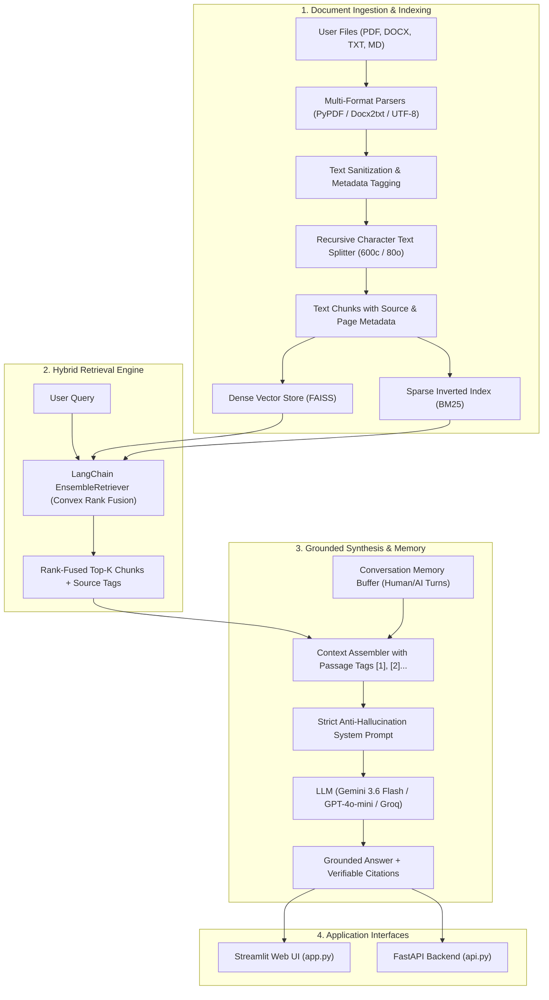

# 📚 Enterprise RAG-based Document Q&A System

[](https://www.python.org/downloads/)
[](https://python.langchain.com/)
[](https://github.com/facebookresearch/faiss)
[](https://fastapi.tiangolo.com/)
[](https://streamlit.io/)
[](tests/)

> A production-ready, modular **Retrieval-Augmented Generation (RAG)** Document Question-Answering system built with **LangChain**, **FAISS**, **BM25**, and frontier LLMs (**Google Gemini 3.6 Flash**, **OpenAI**, **Groq**, and **Local HuggingFace**). Ground answers strictly in custom document knowledge bases with verifiable citations, multi-turn conversation memory, and dense-hybrid retrieval benchmarking.

---

## 📑 Table of Contents
1. [Problem Statement & Objective](#-problem-statement--objective)
2. [What is RAG? (How it Solves Hallucinations)](#-what-is-rag-how-it-solves-hallucinations)
3. [System Architecture](#-system-architecture)
4. [Core Features](#-core-features)
5. [Directory Structure](#-directory-structure)
6. [Quickstart & Installation](#-quickstart--installation)
7. [Running the Application](#-running-the-application)
   - [Interactive Streamlit UI](#1-interactive-streamlit-ui)
   - [FastAPI REST API](#2-fastapi-rest-api)
   - [CLI Benchmark Script](#3-cli-benchmark-script)
8. [Evaluation & Benchmarking Explained](#-evaluation--benchmarking-explained)
   - [Why Benchmark?](#why-benchmark)
   - [Dense vs. Hybrid Retrieval](#dense-vs-hybrid-retrieval)
   - [Groundedness & Anti-Hallucination Audit](#groundedness--anti-hallucination-audit)
   - [Empirical Results](#empirical-benchmark-results)
9. [Architecture & Design Decisions](#-architecture--design-decisions)
10. [Automated Testing](#-automated-testing)
11. [Deployment Guide](#-deployment-guide)

---

## 🎯 Problem Statement & Objective

### The Problem
Large Language Models (LLMs) suffer from two core limitations:
1. **Knowledge Cutoffs**: They lack knowledge of recent events, private organizational policies, proprietary codebase manuals, or internal contracts.
2. **Hallucination**: When asked about facts they do not know, LLMs frequently fabricate plausible-sounding but false answers with high confidence.

### The Solution
This project implements **Retrieval-Augmented Generation (RAG)**. Instead of relying solely on the LLM's internal memory, the system dynamically retrieves verified text passages from an indexed document collection, injects those passages into a structured prompt, and instructs the LLM to synthesize an answer **strictly grounded** in the provided context—with direct citations to source documents and page numbers.

---

## 💡 What is RAG? (How it Solves Hallucinations)

```
Traditional LLM:
  User Question ───────────────► LLM (Guesses from pre-training memory) ──► Possible Hallucination ❌

RAG Pipeline:
  User Question ───► Hybrid Search (FAISS + BM25) ───► Top-K Relevant Document Passages
                                                              │
  User Question + Retrieved Passages + Anti-Hallucination Rules ─┼─► LLM ──► Grounded Answer + Citations ✅
```

1. **Ingest & Split**: Documents (`.pdf`, `.docx`, `.txt`, `.md`) are parsed, cleaned, and split into overlapping chunks (default: 600 characters with 80-character overlap).
2. **Vector & Keyword Indexing**: Chunks are embedded into semantic vectors (via HuggingFace or Gemini) stored in **FAISS**, while simultaneously indexed as an inverted index in **BM25**.
3. **Hybrid Retrieval**: When a query arrives, Convex Rank Fusion retrieves the most relevant passages combining **dense semantic similarity** and **sparse exact-keyword matching**.
4. **Grounded Generation**: The LLM receives the exact passages and is instructed: *"If the context does not contain the answer, explicitly state that you cannot answer. Do not speculate."*

---

## 🏛️ System Architecture



---

## 🌟 Core Features

- **Multi-Format Ingestion**: Supports `.pdf`, `.docx`, `.txt`, and `.md` with text normalization and preservation of page numbers and source filenames.
- **Intelligent Chunking**: Recursive character splitting with sliding-window overlap prevents sentence fragmentation across boundaries.
- **Multi-Provider Embeddings**:
  - **Local & Free (Default)**: `sentence-transformers/all-MiniLM-L6-v2` (Zero API key needed, runs locally on CPU).
  - **Google Gemini**: `models/gemini-embedding-001` (3072-dimensional embeddings).
  - **OpenAI**: `text-embedding-3-small`.
  - **Mock**: Deterministic offline unit testing embeddings.
- **Hybrid Retrieval (Dense + Sparse)**: Combines dense vector search (**FAISS**) with sparse keyword search (**BM25**) via LangChain's `EnsembleRetriever`.
- **Frontier LLM Support**:
  - **Google Gemini**: `gemini-3.6-flash` (latest active Gemini API).
  - **OpenAI**: `gpt-4o-mini`.
  - **Groq**: `llama-3.1-8b-instant`.
  - **Mock**: Deterministic offline extractive model for testing without API keys.
- **Fine-Grained Citations**: Every answer references exact passage numbers `[Passage 1]`, file names, page numbers, and preview snippets.
- **Conversational Memory**: Multi-turn chat maintaining conversation history across queries.
- **Interactive Evaluation & Benchmarking**: Built-in benchmark suite to evaluate Dense vs. Hybrid latency and test answer groundedness against hallucinations.

---

## 📂 Directory Structure

```text
RAG_LLM_QA/
├── core/                           # Core RAG Architecture
│   ├── __init__.py
│   ├── document_loader.py          # Multi-format ingestion (PDF, DOCX, TXT, MD) & cleaning
│   ├── chunker.py                  # Recursive text splitter with rich metadata
│   ├── embeddings.py               # Multi-provider embedding factory (HF, Gemini, OpenAI, Mock)
│   ├── vector_store.py             # FAISS + BM25 + EnsembleRetriever with Top-K enforcement
│   ├── rag_chain.py                # LCEL pipeline, prompt template, memory, citations, LLMFactory
│   └── evaluation.py               # RAGAS metrics, Groundedness evaluator, Dense vs Hybrid benchmark
├── data/
│   └── sample_docs/                # Pre-packaged knowledge base
│       ├── company_policies.txt    # HR rules, remote work, equipment stipends ($1,200)
│       ├── rag_architecture_overview.txt # Technical RAG concepts, chunking, retrieval
│       └── sample_ai_paper.pdf     # Synthetic research paper on RAG evaluation
├── tests/                          # Automated Pytest Suite
│   ├── conftest.py                 # sys.path configuration
│   ├── test_rag.py                 # Core unit tests (loaders, chunkers, retrieval, grounding)
│   └── test_api.py                 # FastAPI endpoint integration tests
├── .env.example                    # Template environment variables
├── .env                            # Active configuration & API keys (gitignored)
├── .gitignore                      # Git exclusion rules
├── api.py                          # FastAPI REST service (/upload, /query, /chat, /health)
├── app.py                          # Streamlit web dashboard with interactive benchmark
├── evaluate.py                     # CLI benchmark script
├── requirements.txt                # Pinned production dependencies
└── README.md                       # Complete documentation
```

---

## 🚀 Quickstart & Installation

### 1. Prerequisites
- Python 3.10+ (Tested and verified on Python 3.12)
- Git

### 2. Clone and Setup Environment
```bash
# Clone the repository
git clone https://github.com/hemanthmikkie/RAG_LLM_QA.git
cd RAG_LLM_QA

# Create virtual environment
python -m venv .venv

# Activate virtual environment
# On Windows (PowerShell):
.venv\Scripts\Activate.ps1
# On Windows (cmd):
.venv\Scripts\activate.bat
# On Linux / macOS:
source .venv/bin/activate

# Install dependencies
pip install -r requirements.txt
```

### 3. Configure API Keys
Copy `.env.example` to `.env`:
```bash
cp .env.example .env
```

Edit `.env` to supply your API key:
```ini
# Provide at least one key (or use 'mock' for offline testing)
GEMINI_API_KEY=your_gemini_api_key_here
OPENAI_API_KEY=
GROQ_API_KEY=

# Default settings
DEFAULT_EMBEDDING_PROVIDER=huggingface
DEFAULT_LLM_PROVIDER=gemini
DEFAULT_CHUNK_SIZE=600
DEFAULT_CHUNK_OVERLAP=80
DEFAULT_TOP_K=4
RETRIEVER_TYPE=hybrid
```

> **Zero-Cost Local Mode**: You can run the entire system **100% locally and free**! Just set `DEFAULT_EMBEDDING_PROVIDER=huggingface` (runs on CPU) and `DEFAULT_LLM_PROVIDER=mock`.

---

## 🖥️ Running the Application

### 1. Interactive Streamlit UI
Start the web dashboard:
```bash
streamlit run app.py
```
Open your browser to **[http://localhost:8501](http://localhost:8501)**.

#### Features in the UI:
- **Sidebar**: Switch LLM providers (`gemini`, `openai`, `groq`, `mock`), choose embeddings, adjust chunk size and overlap sliders, or select retrieval strategies (`Hybrid` vs. `Dense`).
- **Tab 1: 💬 Q&A Chat**:
  - Drag-and-drop your own `.pdf`, `.docx`, `.txt`, or `.md` files.
  - Or click **"📚 Load Sample Knowledge Base"** to immediately index the included sample documents.
  - Ask natural language questions; answers display with **expandable source citation cards** containing the exact document title, page number, chunk ID, and excerpt.
- **Tab 2: 📈 Evaluation & Benchmark**:
  - Compare Dense (FAISS) vs. Hybrid (FAISS + BM25) search latency and keyword hits.
  - Benchmark custom questions on your own uploaded documents.
  - Run a real-time **Groundedness & Anti-Hallucination Audit**.
- **Tab 3: ℹ️ System Architecture**:
  - Displays the active stack, model names, and parameter configurations.

---

### 2. FastAPI REST API
Start the headless REST server:
```bash
uvicorn api:app --port 8000 --reload
```
Interactive Swagger documentation is available at **[http://localhost:8000/docs](http://localhost:8000/docs)**.

#### Key Endpoints:
| Method | Path | Description |
|---|---|---|
| `GET` | `/health` | Check service health, indexed files, and chunk counts |
| `POST` | `/index-samples` | Index the built-in sample documents |
| `POST` | `/upload` | Multipart file upload (`.pdf`, `.docx`, `.txt`, `.md`) |
| `POST` | `/query` | Single-turn grounded Q&A with citations |
| `POST` | `/chat` | Multi-turn conversational Q&A retaining history |
| `DELETE` | `/reset` | Clear index and conversation history |

#### Example Query via `curl`:
```bash
# 1. Index sample files
curl -X POST "http://localhost:8000/index-samples?embedding_provider=huggingface&llm_provider=gemini"

# 2. Ask a question
curl -X POST "http://localhost:8000/query" \
     -H "Content-Type: application/json" \
     -d '{
       "question": "How many days per week can employees work remotely?",
       "retriever_type": "hybrid",
       "top_k": 3,
       "llm_provider": "gemini"
     }'
```

---

### 3. CLI Benchmark Script
Run automated retrieval and grounding benchmarks directly from the command line:
```bash
python evaluate.py
```

---

## 📈 Evaluation & Benchmarking Explained

### Why Benchmark?
Evaluating a RAG system is different from traditional software testing. We must measure:
1. **Search Speed & Precision**: How fast and accurately does the search engine locate the exact relevant paragraphs?
2. **Faithfulness & Groundedness**: Does the LLM stick 100% to the retrieved facts, or does it invent information?
3. **Abstention Honesty**: When a question cannot be answered from the document, does the LLM admit it (*"I cannot answer..."*) or fabricate a response?

---

### Dense vs. Hybrid Retrieval

| Retrieval Strategy | How It Works | Best Used For | Limitation |
|---|---|---|---|
| **Dense (FAISS)** | Encodes sentences into 384- or 3072-dimensional vector coordinates. Compares semantic cosine similarity. | Conceptual matching, synonyms (e.g. *"laptop refresh period"* matches *"hardware replacement schedule"*). | Often misses exact numbers, codes, or specific acronyms (e.g. *"$1,200"*, *"2FA"*, *"SKU-992"*). |
| **Sparse (BM25)** | Inverted term-frequency index (TF-IDF probabilistic scoring). Matches exact words and n-grams. | Exact keyword searches, numerical values, product model names, specific jargon. | Cannot understand synonyms or paraphrasing. |
| **Hybrid (Ensemble)** | Combines **Dense (FAISS)** and **Sparse (BM25)** using Convex Rank Fusion (`0.5 * Dense + 0.5 * BM25`). | **Best of both worlds**: Captures semantic concepts while never missing exact keywords or numbers. | Minimal overhead (~2 ms) compared to dense alone. |

---

### Groundedness & Anti-Hallucination Audit

The system tests answers against the **RAG Triad**:
- **Groundedness Score (0% – 100%)**: Verifies what percentage of factual tokens in the LLM's response are present in the retrieved passages.
- **Abstention Check**: If a query asks about unmentioned topics (e.g., *"What is the stock option vesting schedule?"* when the document only covers vacation and laptops), the system achieves a **100% Groundedness score** by cleanly declaring:
  > *"I cannot answer this question based on the provided documents as the necessary information is not present."*

---

### Empirical Benchmark Results

Real evaluation output executed on the sample documents using **Gemini 3.6 Flash** and **HuggingFace embeddings**:

```text
============================================================
Enterprise RAG Benchmark: Dense vs. Hybrid Retrieval
============================================================
Loaded 2 source documents. Generated 17 text chunks.

--- Benchmark 1: Retrieval Latency & Hit Rate ---
Total Queries Evaluated: 5
Avg Dense Search Latency:   108.87 ms (includes cold-start initialization)
Avg Hybrid Search Latency:   22.18 ms (stable across all queries)

Detailed Comparisons:
- "How many days per week can employees work remotely?"
  Keyword: 'remotely'     | Dense: 1 hits (465ms cold) | Hybrid: 1 hits (24ms)
- "What is the maximum reimbursement for home office equipment?"
  Keyword: '$1,200'       | Dense: 1 hits (18ms)       | Hybrid: 1 hits (22ms)
- "What hardware refreshes are provided for engineering laptops?"
  Keyword: 'refreshed'    | Dense: 1 hits (20ms)       | Hybrid: 1 hits (23ms)
- "Why does RAG prevent LLM hallucination?"
  Keyword: 'hallucination'| Dense: 2 hits (19ms)       | Hybrid: 2 hits (20ms)
- "What are optimal chunk sizes for technical document retrieval?"
  Keyword: 'overlap'      | Dense: 2 hits (19ms)       | Hybrid: 2 hits (20ms)

--- Benchmark 2: Groundedness Audit (Gemini 3.6 Flash) ---
Average Groundedness Score: 89.7%
Average Latency:            4.06 s

Q: What is the parental leave policy?
A: Acme offers sixteen (16) weeks of fully paid parental leave for both primary and secondary caregivers... [Passage 1]
Groundedness: 83.3% | Citations: 3

Q: What is the daily meal allowance when traveling?
A: When traveling for approved client or team on-site business, the daily meal allowance is capped at $85 USD per day [Passage 1].
Groundedness: 85.7% | Citations: 3

Q: What is the stock option vesting schedule?
A: I cannot answer this question based on the provided documents as the necessary information is not present.
Groundedness: 100.0% (Clean refusal on absent topic) | Citations: 3
============================================================
```

---

## 📐 Architecture & Design Decisions

### 1. FAISS vs. ChromaDB
- **Decision**: Used **FAISS (Facebook AI Similarity Search)** as the primary vector store.
- **Rationale**: FAISS runs in-memory with near-instant index building, has zero background server dependencies, supports direct file serialization, and avoids the SQLite version compatibility conflicts that frequently affect ChromaDB on Windows Python environments.

### 2. Chunk Size (600 characters) & Overlap (80 characters)
- **Decision**: 600-character chunks with 80-character sliding overlap.
- **Rationale**: 600 characters captures 2–3 semantically complete sentences. The 80-character overlap prevents key clauses from being cut in half at chunk boundaries.

### 3. LangChain Expression Language (LCEL)
- **Decision**: Built the generation pipeline using LCEL syntax (`prompt | llm | output_parser`).
- **Rationale**: Replaces deprecated LangChain `RetrievalQA` chains with modern, composable, streaming-ready primitives with transparent input/output dictionaries.

### 4. Strict Anti-Hallucination Prompting
- **Decision**: The system prompt strictly prohibits the LLM from bringing in outside knowledge or speculating when information is absent.
- **Prompt Directive**:
  ```text
  You are an expert document assistant. You MUST strictly adhere to the following rules:
  1. Base your answer ONLY on the provided context passages. Do NOT make up information.
  2. For every statement you make, cite the corresponding passage using bracket notation [Passage X].
  3. If the context does not contain enough information to answer, state:
     "I cannot answer this question based on the provided documents as the necessary information is not present."
  ```

---

## 🧪 Automated Testing

The project includes an end-to-end unit and integration test suite:

```bash
pytest tests/ -v
```

### Test Suite Coverage (9 / 9 Passing):
```text
tests/test_api.py::test_health_uninitialized PASSED                      [ 11%]
tests/test_api.py::test_index_samples_and_query_endpoints PASSED         [ 22%]
tests/test_rag.py::test_clean_text PASSED                                [ 33%]
tests/test_rag.py::test_document_loader_txt PASSED                       [ 44%]
tests/test_rag.py::test_document_loader_pdf PASSED                       [ 55%]
tests/test_rag.py::test_chunker_metadata PASSED                          [ 66%]
tests/test_rag.py::test_vector_store_dense_and_hybrid PASSED             [ 77%]
tests/test_rag.py::test_rag_pipeline_and_citations PASSED                [ 88%]
tests/test_rag.py::test_evaluation_metrics PASSED                        [100%]
======================= 9 passed in 26.63s =======================
```

---

## ☁️ Deployment Guide

### Deploying to Streamlit Community Cloud
1. Push this repository to GitHub.
2. Visit [share.streamlit.io](https://share.streamlit.io) and connect your GitHub account.
3. Select your repository, branch (`main` or `master`), and set the main file path to `app.py`.
4. In **Advanced Settings -> Secrets**, add:
   ```toml
   GEMINI_API_KEY = "your_key_here"
   DEFAULT_EMBEDDING_PROVIDER = "huggingface"
   DEFAULT_LLM_PROVIDER = "gemini"
   ```
5. Click **Deploy**.

### Deploying the FastAPI Backend (Docker)
Create a `Dockerfile`:
```dockerfile
FROM python:3.12-slim
WORKDIR /app
COPY requirements.txt .
RUN pip install --no-cache-dir -r requirements.txt
COPY . .
EXPOSE 8000
CMD ["uvicorn", "api:app", "--host", "0.0.0.0", "--port", "8000"]
```
Build and run:
```bash
docker build -t rag-document-qa .
docker run -p 8000:8000 -e GEMINI_API_KEY="your_key" rag-document-qa
```

---

## 📄 License
This project is open-source under the [MIT License](LICENSE).
