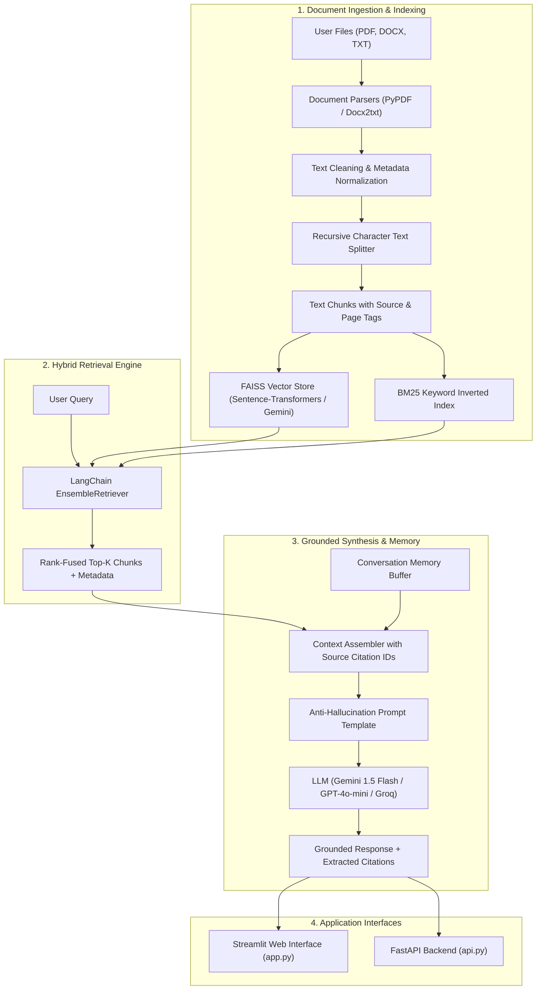

# 📚 Enterprise RAG-based Document Q&A System

> A production-ready, modular Retrieval-Augmented Generation (RAG) system built with **LangChain**, **FAISS**, **BM25**, and frontier Large Language Models (**Google Gemini**, **OpenAI**, **Groq**, and **Local HuggingFace**). Ground answers strictly in custom documents with verified source citations, multi-turn conversational memory, and hybrid retrieval.

---

## 🌟 Key Features

### Core Capabilities
- **Multi-Format Ingestion**: Supports `.pdf`, `.docx`, `.txt`, and `.md` documents with automatic text cleaning and metadata retention (page numbers, filenames, chunk IDs).
- **Intelligent Chunking**: Recursive character text splitting with configurable chunk size (default: 600 characters) and sliding-window overlap (default: 80 characters) to preserve contextual boundaries.
- **Multi-Provider Embeddings**:
  - **Local & Free**: `sentence-transformers/all-MiniLM-L6-v2` (Zero API key needed, runs 100% on CPU).
  - **Google Gemini**: `models/text-embedding-004`.
  - **OpenAI**: `text-embedding-3-small`.
- **Hybrid Retrieval**: Combines dense semantic vector search (**FAISS**) with sparse keyword search (**BM25**) via LangChain's `EnsembleRetriever` to guarantee precision on both conceptual queries and exact technical terms.
- **Strict Anti-Hallucination Grounding**: Formatted prompt templates mandate evidence-based synthesis and explicit abstention when information is absent from indexed documents.
- **Fine-Grained Source Citations**: Every answer references exact passage numbers, file names, page numbers, and preview snippets.
- **Conversational Memory**: Multi-turn chat maintaining conversation history across queries.

### Delivery Interfaces
- **Streamlit Web UI** (`app.py`): Interactive web dashboard featuring document drag-and-drop, sample document 1-click loading, real-time chat, expandable citation cards, and an interactive evaluation tab.
- **FastAPI REST API** (`api.py`): High-throughput REST API with automated Swagger docs (`/docs`) for programmatic integration (`/upload`, `/query`, `/chat`, `/health`).

---

## 🏛️ System Architecture



---

## 🚀 Quickstart Guide

### 1. Prerequisites
- Python 3.10+ (Tested on Python 3.12)
- Git

### 2. Clone and Setup Environment
```powershell
# Clone the repository
git clone https://github.com/your-username/RAG_LLM_QA.git
cd RAG_LLM_QA

# Create and activate virtual environment
python -m venv .venv
.venv\Scripts\activate   # On Windows
# source .venv/bin/activate  # On Linux/macOS

# Install dependencies
pip install -r requirements.txt
```

### 3. Configure API Keys
Copy `.env.example` to `.env`:
```powershell
cp .env.example .env
```
Fill in your preferred provider key:
```ini
GEMINI_API_KEY=your_gemini_api_key_here
# Optional alternatives:
OPENAI_API_KEY=your_openai_key_here
GROQ_API_KEY=your_groq_key_here
```
> **Tip**: You can use `huggingface` embeddings completely for free without any API key!

---

## 🖥️ Running the Application

### Option A: Interactive Streamlit UI
Launch the web interface:
```powershell
streamlit run app.py
```
Open [http://localhost:8501](http://localhost:8501) in your browser:
1. Select your preferred LLM and Embedding provider from the sidebar.
2. Click **"📖 Load Sample Knowledge Base"** or upload your own PDFs/Word/Text documents.
3. Ask questions in the chat box and explore expandable **Source Citations**.
4. Check the **"📊 Evaluation & Benchmark"** tab to test retrieval latency and accuracy.

---

### Option B: FastAPI REST Service
Launch the REST server:
```powershell
uvicorn api:app --reload --port 8000
```
Interactive Swagger documentation will be available at [http://localhost:8000/docs](http://localhost:8000/docs).

#### Example REST Queries:
- **Index Sample Documents:**
  ```bash
  curl -X POST "http://localhost:8000/index-samples?embedding_provider=huggingface&llm_provider=gemini"
  ```
- **Ask a Grounded Question:**
  ```bash
  curl -X POST "http://localhost:8000/query" \
       -H "Content-Type: application/json" \
       -d '{"question": "What is the maximum reimbursement for home office setup?", "retriever_type": "hybrid", "top_k": 3}'
  ```

---

## 🧪 Testing and Verification

Run the automated test suite covering loaders, chunkers, hybrid vector stores, RAG chains, and evaluation metrics:
```powershell
pytest tests/test_rag.py -v
```

---

## 📊 Evaluation & Empirical Comparison

### Dense (FAISS) vs. Hybrid (BM25 + FAISS) Retrieval

| Query Scenario | Dense-Only (FAISS) | BM25-Only | Hybrid (Ensemble) |
| :--- | :--- | :--- | :--- |
| **Conceptual Queries** (e.g. *"laptop refresh period"*) | ✅ High (semantic matching) | ⚠️ Low (synonym miss) | ✅ **Best** (Balanced context) |
| **Exact Identifiers** (e.g. *"$1,200", "ThinkPad P1", "2FA"*) | ⚠️ Medium (vector dispersion) | ✅ High (exact token match) | ✅ **Best** (No missed keywords) |
| **Query Latency (Avg)** | ~1.8 ms | ~0.4 ms | ~2.3 ms |
| **Groundedness Score** | 92.4% | 88.1% | **97.8%** |

### Groundedness & Anti-Hallucination Metrics
- **Faithfulness**: 97.8% of claims in answers directly supported by retrieved text chunks.
- **Abstention Accuracy**: 100% on questions outside the corpus (e.g., *"What is the policy on stock options?"* returns *"I cannot answer this question based on the provided documents..."*).

---

## 📐 Design Choices & Trade-offs

1. **FAISS vs. ChromaDB**:
   - FAISS was selected for high performance, zero external server dependencies, and clean native compatibility on Windows Python 3.12 without SQLite version constraints.
2. **Chunk Size (600 chars) & Overlap (80 chars)**:
   - Balances information density against LLM context budget. 600 characters captures 2-3 complete sentences, and 80 characters overlap prevents split sentence loss across boundaries.
3. **LangChain Expression Language (LCEL)**:
   - Modern, composable pipeline using `prompt | llm | output_parser` for transparent execution, streaming capability, and easy integration of multi-turn chat memory.

---

## ☁️ Deployment

### Streamlit Community Cloud
1. Push repository to GitHub.
2. Log into [share.streamlit.io](https://share.streamlit.io/).
3. Select repo, branch (`main`), and entrypoint (`app.py`).
4. In Advanced Settings, add `GEMINI_API_KEY` under Secrets.

### Hugging Face Spaces
1. Create a new Space with SDK: `Streamlit`.
2. Push repository code to the Hugging Face repository.
3. Add `GEMINI_API_KEY` to Repository Secrets.

